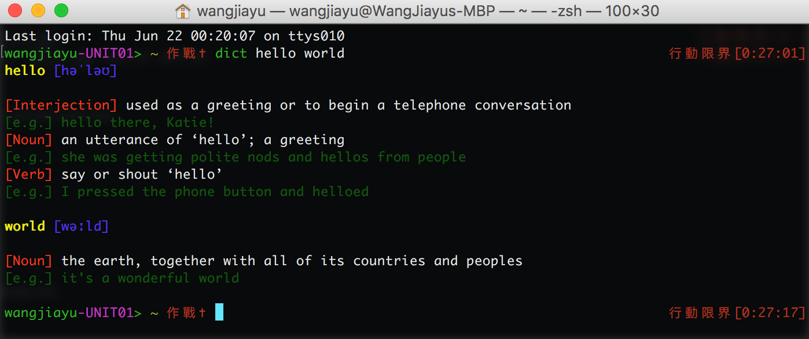

# dict
a very simple dictionary can be used in your terminal
## Usage
1. Download the dict.py file
2. Add `alias dict='python /path/to/dict.py'
3. Type `dict hello world` in your terminal
#### Effect
```shell
dict hello world
```
<p align="left">
</p>
